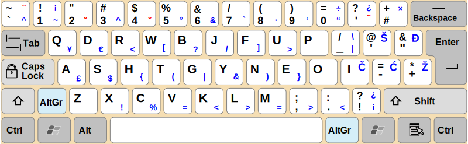

## Keyboard mappings

### Workman layout

Sourced from O.J. Bucao's Workman layout https://workmanlayout.org/. This keyboard layout has been developed to be efficient and comfortable when writing English, as opposed to the QWERTY layout, which was apparently designed to prevent typewriters jamming and getting stuck when typing fast.

### Programmer's Workman, Simplified, with Eastern European letters

Adapted from Workman layout, which I found very very good, much better than Dvorak, for example, but still had some annoyances with it, which I decided to get rid of.

#### Making it even better

The original Workman layout moves C and V one position to the right, compared to QWERTY. This makes it more difficult for programmers to get used to the layout because C and V get used very often as copy/paste shortcuts. Since those two letters are only moved by one position in Workman layout I figured it won't do much harm if they just stayed where they were originally in QWERTY. As a result, Simplified Programmer's Workman layout retains C and V in their original positions to make the entire ZXCV block unchanged in regard to QWERTY.

Other adaptations include placing often used symbols in coding to more optimal positions in near reach; for example parenteshes (), brackets [], and braces {}, all reside on index finger and middle finger column positions on level 3 (AltGr). Original Workman layout places those symbols at the far end of top row, which I found very inconvenient.

The layout also retains Eastern European letters on levels 3 and 4 (AltGr and Shift+AltGr, respectively) on the usual positions of Southern Slavic keyboard layouts.

To make it easier to reach level 3, there is an additional level 3 modifier key mapped next to left Shift on 105 key ISO keyboard, however not all keyboards will have that key.
